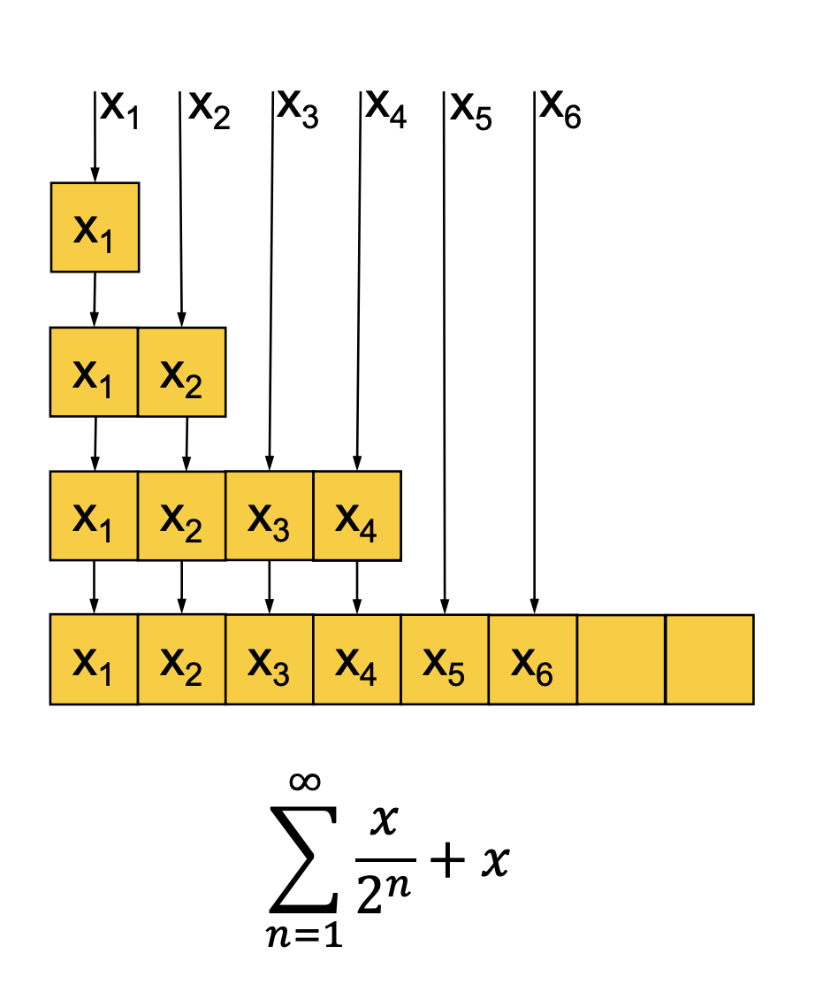

# Алгоритмы
Описание ...

- [<- назад](../README.md)

## Сложность

Есть три способа определять сложность:
- О большое ("О"-нотация)
- ω (омега)
- θ (тетта)

**О большое**
Такая функция O(N), которая при N -> бесконечности будет больше сложности нашего алгоритма. Может быть O(N), O(N^2), O(lonN) и тд.

**ω (омега)**
Такая функция ω(N), которая при N -> бесконечности будет меньше сложности нашего алгоритма.

**θ (тетта)**
Это когда мы находим такую ω и такое О, которые равны друг другу. Существует не всегда.

На практике используется в основном только О.

При оценке алгоритма, обычно для алгоритма указывают три оценки:
- в лучшем случае
- в худшем случае  
- в ожидаемом (наиболее частом)

Поэтому, мы ориентируемся либо на худший случай, либо на **амортизированную оценку**

**Худший случай**

Оценивая примерное время алгоритма, важно понимать, чем мы пренебрегаем, а за чем следим (чтобы не пропустить главное и не копаться в несущественных деталях). Распространённый подход –– оценивать время работы алгоритма (как функцию от размера входа) с точностью до ограниченных множителей. При этом ошибка в два раза или даже в тысячу раз считается допустимой, в то время как разница между n и n^2
считается существенной.

При таком подходе нет надобности разбираться в длительности элементарных операций, хотя в реальных процессорах разные команды разлагаются в последовательность микрокоманд разной длины и занимают разное время. Важно только, что время любой операции ограничено некоторой константой. Другое следствие того же подхода: если, скажем, алгоритм выполняет `5n^3 + 4n + 3` элементарных операций на входе размера `n`, мы можем отбросить слагаемые `4n` и `3` (которые при больших `n` малы по сравнению с `5n^3`). Более того, мы можем отбросить и множитель `5` в старшем слагаемом (через несколько лет компьютеры станут в пять раз быстрее) и сказать, что время работы алгоритма есть O(n^3)) (произносится как «о большое от эн в кубе»).

**Амортизированная оценка**

Разберем на примере [динамического массива](../data_stracture/dynamic_array/README.md). Он работает как слайс в Go. По массив выделяется память, мы добавляем туда эллементы, если память закончилась, создается массив с два раза большей памятью, туда копируются эллементы из старого массива и мы продолжаем добавлять туда нвоые эллементы.

- **Худший случай:** О(N)
- **Лучший случай:** Константа
- **Амортизированная сложность** же будет вычислять по формуле с картинки (послучаем 2х) и вычислить сложность однйо вставки (2х / х) - константа

В большинстве случаев амортизированной сложности нам будет достаточно. Но если мы не готовы мириться с некоторыми усреднениями, то необходимо пользоваться худшим случаем.

## Оптимизация решений

### Решение задачи с нуля

- Если есть подозрение на NP-полноту, то постараться свести к известной задаче. Либо в процессе этого мы поймем, что задача не NP полная, либо докажем ее NP-полноту.

### Стратегии оптимизации 
- **Разделяй и властвуй!** Например как в merge sort-е. У нас есть задача, которая тривиально решается при определенном размере данных (сортировка массива из 1 элемента) и есть операция, которая позволяет дешево эти операции объеденить. Чаще всего не будет быстрее чем О(N*logN)
- **Сортировка**
- **Построение вспомогательных структур – словари, деревья, стэки.** Можно использовать для избавления от дублей, деревья для ускореня поиска. Хорошо работает если мы несколько раз проходим по данным (подготовка данных - потом активное пользование ими). Задачи, которые надо решать на стеках, обычно легко вычленить. Они почти все выглядят так, буд-то их надо решать рекурсией.
- **Избавление от рекурсии. Хвостовая рекурсия.** Если можно свести рекурсию к хвостовой рекурсии (сразу возвращает результат из функции), то значит ее можно превратить в цикл и избавиться от стека (соответственно нет накопления данных - выигрышь по пространству).
- **Неиспользованные условия, или свойства.** Если у нас есть дополнительные условия или свойства, то возможно задействование их позволит ускорить и упростить наш алгоритм.
- **Разбиение задачи на частные случаи.** В зависимости от каких-то условий применяем то или иное решение (алгоритм).

# РАЗОБРАТЬ
- [АЛГОРИТМЫ НА ГО](https://github.com/TheAlgorithms/Go)
- [Алгоритмы на го](https://github.com/polosate/algorithms)
- [Го и алгоритмы](https://yourbasic.org/algorithms/)
- [Список алгоритмов](https://algorithmswithgo.com/)
http://aliev.me/runestone/AlgorithmAnalysis/BigONotation.html
http://aliev.me/runestone/
- [«Алгоритмы и структуры данных поиска» Максим Бабенко](https://www.youtube.com/watch?v=5qmYaOoHX8A&list=PLJOzdkh8T5koEPv-R5W0ovmL_T2BjB1HX)
- [Introduction to Algorithms. MIT](https://ocw.mit.edu/courses/electrical-engineering-and-computer-science/6-006-introduction-to-algorithms-fall-2011/index.htm)
https://habr.com/ru/company/yandex/blog/449890/
https://habr.com/ru/post/188010/
- [Список алгоритмов Wiki](https://en.wikipedia.org/wiki/List_of_algorithms)
- [Рекомендации Яндекса по изучению алгоритмов и стркутур данных](https://academy.yandex.ru/posts/5-sposobov-pobolshe-uznat-ob-algoritmakh)
- [Введение в анализ сложности](https://habr.com/ru/post/196560/)
- [Крутая статья по сложности алгоритмов и структурам](https://habr.com/ru/post/310794/)
- [Bjarne Stroustrup: Why you should avoid Linked Lists](https://www.youtube.com/watch?v=YQs6IC-vgmo)
- [Computer Science еще жива (Intellij IDEA.)](https://2016.jokerconf.com/talks/computer-science-is-not-dead-yet/)
- Операции с большими числами
- https://tproger.ru/digest/competitive-programming-practice/
- exercism.io

- [Олимпиадное программирование](https://qna.habr.com/q/61386)

# Литература и видео
- [Алгоритмы – Илья Волков](https://www.youtube.com/watch?v=ECOZDHS5DfE&list=PLQC2_0cDcSKBHamFYA6ncnc_fYuEQUy0s&index=8)
- [Алгоритмы (OZON)](https://ozonmasters.ru/algomain)
