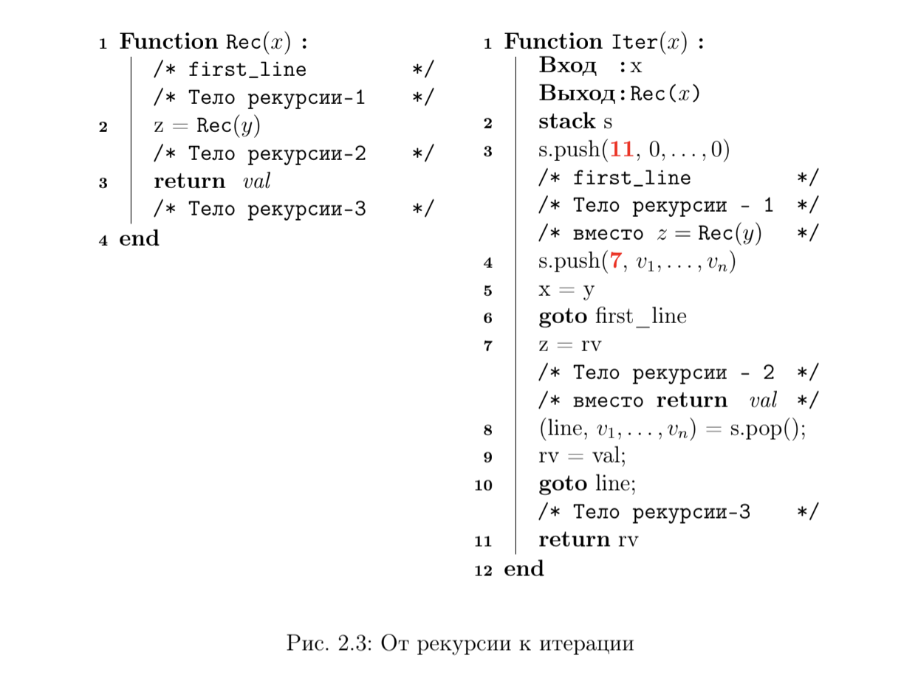

# Рекурсивные алгоритмы

**Рекурсия** – фундаментальное понятие в математике и компьютерных науках. В языках программирования рекурсивной программой называется программа, которая обращается сама к себе (подобно тому, как в математике рекурсивная функция определяется через понятия самой этой функции). Рекурсивная программа не может вызывать себя до бесконечности, следовательно, вторая важная особенность рекурсивной программы – наличие условия завершения, позволяющее программе прекратить вызывать себя.

- Программа (функция) вызывает сама себя
- Имет условия выхода из рекурсии

## Переход от рекурсии к итерациям

**Любой рекурсивный алгоритм можно задать итеративно и  наоборот.**

Если итерация, это все что лежит в каком то цикле, то мы легко ее можем выразить с помощью хвостовой рекурсии.

Часто, при переходе от рекурсии к итерациям используется [стек](../../data_stracture/stack/README.md). Но в случае  с **итеративным алгоритмом Евклида** он не понадобился, т.к. там у нас **хвостовая рекурсия**.

**Обычная рекурсия**

В **обычной рекурсии** типичная модель заключается в том, что сначала выполняется рекурсивный вызов, а затем берется возвращаемое значение рекурсивного вызова и вычисляется результат. Таким образом, вы не получите результат вычисления, пока не вернетесь из каждого рекурсивного вызова. Поэтому появляется необходимость сохранять промежуточные вычисления каждого вызова в [стеке](../../data_stracture/stack/README.md) (который растет по мере увеличения количества вызовов рекурсивной функции). 

**В стеке сохраняются значения переменных и номер строки, на который необходимо вернуться после окончания выполнения рекурсивного вызова.**

Если незавершенных рекурсивных вызов слишком много (хотя вы по ошибке могли написать и программу с бесконечной рекурсией – тогда вам ничто не поможет), то система выдаст сообщение «Stack overflow» («Переполнение стека»).

Псевдокод перехода от рекурсии к итерации выглядит так:

Это по сути иллюстрация работы компилятора. При компиляции рекурсия разворачивается в такой код. Также, вполне возможно, выполняя поиск в глубину по большому графу, мы столкнемся с тем, что не сможем использовать стек вызовов, т.к. он может быть переполнен (не поместятся все наши вызовы туда), поэтому нам прийдется сделать итеративный вариант алгоритма поиска в глубину, со стеком. И даже возможно прийдется хранить его не в оперативной памяти а на жестком диске.

**Хвостовая рекурсия** 

Это частный случай рекурсии, при котором любой рекурсивный вызов является последней операцией перед возвратом из функции.

В **хвостовой рекурсии** сначала выполняются вычисления, а затем выполняется рекурсивный вызов, передающий результаты текущего шага следующему рекурсивному шагу. Это приводит к тому, что последнее действие выглядит как `return (recursive-function params`. Возвращаемое значение любого заданного рекурсивного шага совпадает с возвращаемым значением следующего рекурсивного вызова. 

Следствием этого является то, что как только мы будем готовы выполнить свой следующий рекурсивный шаг, нам больше не понадобится сохранять текущие прмоежуточные вычисления в стек. Это позволяет провести оптимизацию (убрать стек).

## Метод «разделяй и властвуй»

Метод «разделяй и властвуй» (divide-and-conquer) состоит в следующем:

1. Задача разбивается на несколько более простых подзадач (subproblems)
того же типа.
2. Подзадачи решаются рекурсивно.
3. Из ответов для подзадач строится ответ для исходной задачи.

Эффективность такого подхода определяется тем, насколько быстро мы
можем (1) делить задачу на подзадачи; (2) решать подзадачи, не поддающиеся дальнейшему делению и (3) собирать решение задачи из решений подзадач.

Типичные представители данного метода:

- [Двоичный поиск](../рекурсивные_алгоритмы/двоичный_поиск/README.md)
- [Сортировка слиянием](../сортировка/merge_sort/README.md)
