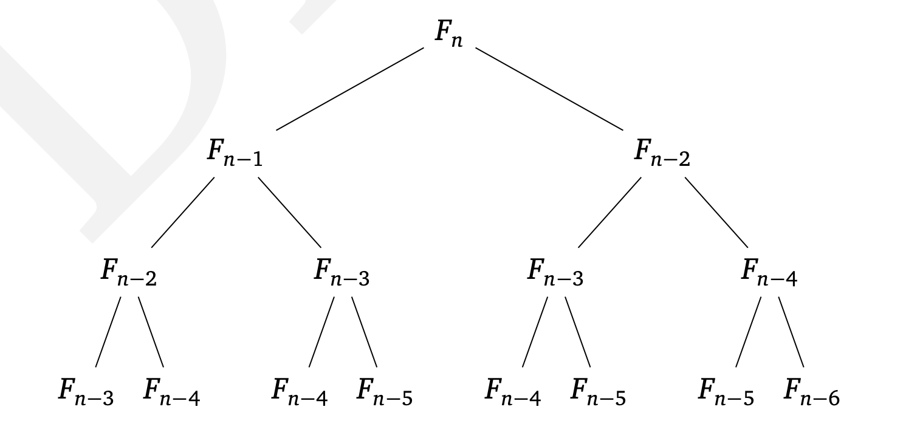

# Числа Фибоначчи

В последовательности Фибоначчи

```
    0, 1, 1, 2, 3, 5, 8, 13, 21, 34
```

каждый член равен сумме двух предыдущих.

Это одна из самых знаменитых последовательностей –– почти как последовательность степеней двойки. Числа Фибоначчи растут почти так же быстро,
как степени двойки: например, F30 больше миллиона, а в десятичной записи F100 уже 21 цифра. Число Fn равно примерно 2^0,694n.

Как вычислять числа Фибоначчи?

## Экспоненциальный алгоритм

``` go
    func fib1(n int) int64 {
        if n == 0 {
            return 0
        }
        if n == 1 {
            return 1
        }

        return fib1(n-1) + fib1(n-2)
    }
```

**Сложность:** `O(2^N)` (экспоненциальная)

Такая сложность означает, что он практически бесполезен на практике. Например, для вычисления F200 понадобится около 2^138 операций. На это даже суперкомпьютеру, выполняющему 40 триллионов операций в секунду, понадобится 2^92 секунд.

На рисунке ниже показано дерево рекурсивных вызовов. Видно, что алгоритм много раз вычисляет одно и то же. Разумнее было бы сохранять промежуточные результаты (значения F0, F1, ‌, Fn−1).



## Полиномиальный алгоритм

``` go
    func fib2(n int) int {
        if n == 0 {
            return 0
        }

        fibNum := make([]int, 0, n+1)
        fibNum = append(fibNum, 0)
        fibNum = append(fibNum, 1)

        for i := 2; i <= n; i++ {
            fibNum = append(fibNum, fibNum[i-1]+fibNum[i-2])
        }

        return fibNum[n]
    }
```

**Сложность:** `O(N)` (линейная)

Есть в нашем анализе и более существенное упрощение: мы считали сложение за один шаг, не учитывая размеры слагаемых. Это разумно, если числа помещаются в один регистр (32 или 64 бита). Однако в двоичной записи n-го числа Фибоначчи около 0,694n битов, и они очень скоро перестают помещаться. Арифметические операции на числах произвольной длины не могут быть выполнены за один шаг. Поэтому нужно более детально оценить время работы алгоритма.

Сложение двух n-битовых чисел требует времени, пропорционального n (сложение в столбик). Значит, алгоритм Fib1, выполняющий около Fn сложений, требует около nFn элементарных операций. Для алгоритма Fib2 время пропорционально `n^2`, что по-прежнему не так много.
