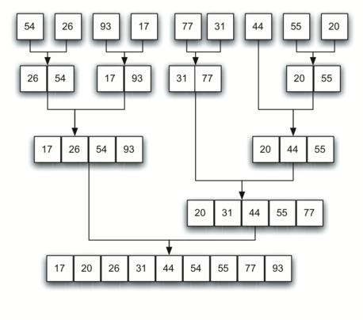

# Сортировка слиянием (merge sort)

**Свойства:**
- рекурсивный алгоритм
- использует метод «разделяй и властвуй»
- Неплохо работает в параллельном варианте: легко разбить задачи между процессорами поровну, но трудно сделать так, чтобы другие процессоры взяли на себя работу, в случае если один процессор задержится.
- На «почти отсортированных» массивах работает столь же долго, как на хаотичных.
- Требует дополнительной памяти по размеру исходного массива.

**Временная сложность:**
- Худшее время: `O(NlogN)`
- Среднее время: `O(NlogN)`
- Лучшее время: `O(NlogN)`
  
**Описание:**

Алгоритм, который постоянно разбивает список пополам. Если список пуст или состоит из одного элемента, то он отсортирован по определению (базовый случай). Если в списке больше, чем один элемент, мы разбиваем его и рекурсивно вызываем сортировку слиянием для каждой из половин. После того, как мы достаточно раздробили массив и каждую частичку отсортировали, выполняется основная операция, называемая слиянием. Слияние - это процесс комбинирования двух меньших сортированных списков в один новый, но тоже отсортированный. На рисунках ниже демонстрация работы сначала разбиянеия потом слияния.




## Рекурсивная форма

Первый вариант
```go
func mergeSort(arr []int) []int {
	if len(arr) == 0 || len(arr) == 1 {
		return arr
	}

	midIDx := len(arr) / 2
	arr1 := mergeSort(arr[:midIDx])
	arr2 := mergeSort(arr[midIDx:])

	sortedMergedArr := make([]int, 0, len(arr1)+len(arr2))
	coursor1, coursor2 := 0, 0

	for {
		if arr1[coursor1] <= arr2[coursor2] {
			sortedMergedArr = append(sortedMergedArr, arr1[coursor1])
			coursor1++

			if coursor1 > len(arr1)-1 {
				sortedMergedArr = append(sortedMergedArr, arr2[coursor2:]...)
				break
			}
		} else {
			sortedMergedArr = append(sortedMergedArr, arr2[coursor2])
			coursor2++

			if coursor2 > len(arr2)-1 {
				sortedMergedArr = append(sortedMergedArr, arr1[coursor1:]...)
				break
			}
		}
	}

	return sortedMergedArr
}
```

Второй вариант
```go
func mergeSort(arr []int) []int {
	if len(arr) == 0 || len(arr) == 1 {
		return arr
	}

	midIDx := len(arr) / 2
	arr1 := mergeSort(arr[:midIDx])
	arr2 := mergeSort(arr[midIDx:])

	sortedMergedArr := make([]int, 0, len(arr1)+len(arr2))
	for len(arr1) > 0 && len(arr2) > 0 {
		if arr1[0] <= arr2[0] {
			sortedMergedArr = append(sortedMergedArr, arr1[0])
			arr1 = arr1[1:]
		} else {
			sortedMergedArr = append(sortedMergedArr, arr2[0])
			arr2 = arr2[1:]
		}
	}

	sortedMergedArr = append(sortedMergedArr, arr1...)
	sortedMergedArr = append(sortedMergedArr, arr2...)

	return sortedMergedArr
}
```