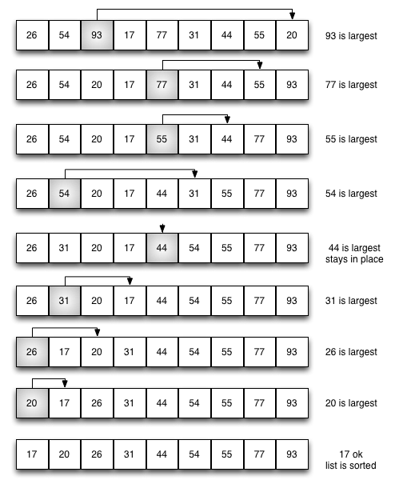

# Selection sort (сортировка выбором)

**Свойства:**
  
**Временная сложность:**
- Худшее время: `O(N^2)`
- Среднее время: `O(N^2)`
- Лучшее время: `O(N^2)`

**Описание:**

**Сортировка выбором** улучшает пузырьковую сортировку, совершая всего один обмен за каждый проход по списку. Чтобы сделать это, она ищет наибольший элемент и помещает его на соответствующую позицию. Как и для пузырьковой сортировки, после первого прохода самый большой элемент находится на правильном месте. После второго - на своё место становится следующий наибольший элемент.

Также возможно сортировать и поиском наименьшего элемента.

## Литература
- [wiki](https://ru.wikipedia.org/wiki/%D0%A1%D0%BE%D1%80%D1%82%D0%B8%D1%80%D0%BE%D0%B2%D0%BA%D0%B0_%D0%B2%D1%8B%D0%B1%D0%BE%D1%80%D0%BE%D0%BC)
- [Problem Solving with Algorithms and Data Structures](http://aliev.me/runestone/SortSearch/TheSelectionSort.html)
