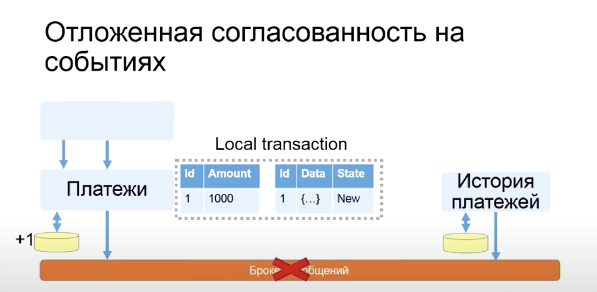

# Микросервисная архитектура

**Плюсы:**
- Атомарность внедрения нового функционала и условная независимость его друг от друга
- Новым сотрудникам легче вносить изменения
- Микросервисы не зависят от какой-либо платформы (любой язык разработки)

**Минусы:**
- Сложность начальной разработки/настройки инфраструктуры
- Дополнительные проблемы из-за большого количества сетевого взаимодействия
- Тяжелее соблюдать строгую согласованность данных

Из-за этого, предлагается подход MonolithFirst

> «не следует начинать новый проект с микросервисов даже при > полной уверенности, что будущее приложение будет достаточно большим, чтобы оправдать такой подход»

# Паттерны микрсоервисной архитектуры

## Database Archetecture

- **Shared database:** мы можем подключаться к одной базе несколькими сервисами
- **Database per service:** одна база - один сервис над ней

**Shared database**

**Плюсы:**
- Разработчик использует знакомые и простые транзакции ACID для обеспечения согласованности данных
- Единая база данных проще в работе
  
**Минусы:**
- Связывание времени разработки (при изменении в БД необходимо менять во всех сервисах)
- Пересечения в runtime: локи, нагрузки и тд (т.к. все микросервисы ходят в одну БД)
- Единая база данных может не соответствовать требованиям хранения данных и доступа ко всем службам

> Недостатки перечеркивают все плюсы «микросервисной архитектуры»

Поэтому **Shared database** стараются не использовать.

## Communication style

### Remote procedure invocation
- REST
- gRPC
- Apache Thrift

> Любой запрос может прерваться

**О чем важно помнить:**
- Настройка ретраев и таймаутов
- Идемпотентность
- Задумываться о нагрузке сервиса, к которому необходимо обратиться
- Поведение на случай, если до сервиса в итоге не получилось достучаться (возможно кеширование предыдущих ответов и возвращение последнего полученного ответа от сервиса)

**Какие проблемы могут возникнуть**
- Сложный флоу может занимать минуты (например флоу оплаты и списания средств с карты)
- Недостаточно гарантий выполнения запроса (например пуш мы отправили, а тикет поставить не смогли - что делать?). Этот случай возникает когда наш сервис должен сделать запросы в n-сервисов, и от каждого получить успешный ответ, но один из сервисов может быть недоступен.
- Некоторые процессы в принципе не имеют требования синхронной обработки

Эти проблемы, как правило, решаются с помощью асинхронного обмена сообщения - **Messaging**

### Messaging
Асинхронный обмен сообщениями. Службы обмениваются сообщениями по каналам (как правило через брокеры сообщений)

Брокеры сообщений:
- Kafka
- RabitMQ
- NATS

К месседж брокеру предъявляются высокие требования доступности - считается, что он всегда доступен.

В данном случае выполнение запроса идет так

- Запрос в наш сервис 
- Запрос из сервиса в месседж брокер
- Воркер (консьюмер) читает из месседж брокера и пытается послать сообщение в необходимый сервис

**Плюсы:**
- Нет runtime-связывания сервисов
- Повышение надежности системы

**Минусы:**
- Усложнение системы в целом (в рамках эксплуатации)
- Высокие требования к брокеру

## Circuit breaker

**Circuit Breaker** предотвращает попытки приложения выполнить операцию, которая скорее всего завершится неудачно, что позволяет продолжить работу дальше не тратя важные ресурсы, пока известно, что проблема не устранена.

Какую проблему решает **Circuit Breaker**? Например *каскадное падение*. Если сервис начинает отвечать намного медленней (например из-за проблем с базой), топо цепочке, все сервисы которые от него зависят, начинают отвечать медленней. Это приводит к существенной деградации сервиса. 

При применении **Circuit Breaker**, он начинает накапливать статистику ответа сервисов, и если процент ошибок растет и достигает какого-то порога (например 90%), то **Circuit Breaker** выставляет статус *Open* и начинает возвращать 500 на все запросы к этому сервису. Это позволяет снизить негативное влияние этого сервиса.

Статусы:
- **Closed**: обычное состояние - собирает статистику.
- **Open**: запрос от приложения немедленно завершает с ошибкой.
- **Half-Open**: проверка состояния внешнего сервиса.

## API composer

Объединение ответов нескольких независимых сервисов в единый ответ.

Примеры:
- Список способов оплаты
- Информация о поездке

## Отложенная согласованность

Если у нас два сервиса общаются через брокер сообщений, возможны ситуации, когда брокер сообщений станет недоступен.

Например у нас есть два сервиса:
- Платежи
- История платежей
  
Они соединены брокером сообщений. Приходит запрос в сервис платежей на создание платежа, платеж создается, отправляется об этом событие в брокер, сервис истории платежей вычитывает из брокера и создает запись в своей БД. Если брокер упадет, мы не сможем создавать платежи, т.к. данные в сервисе платежей будут несогласованными с данными из сервиса истории платежей. Чтобы не становиться заложником такой истории, снизить влияние упавшего брокера, мы можем применить метод `отложенной согласованности`.

Он заключается в том, что сервис платежей, помимо записи о самом платеже, создает еще запись о событии, которое необходимо отправить в брокер сообщений. Эти две записи создаются в одной транзакции, что позволяет нам быть точно уверенными в том, что и платеж и событие о нем созданы. Поднимается шедуллер (или просто крон джоба), которая раз в сколько-то времени проверяет, нет ли неотправленных событий. Если есть - пытается их опять отправить в брокер.

Важно отметить, что сервис который читает из брокера (в нашем случае история платежей) должен быть идемпотентным, т.к. возможно отправление одинаковых данных. Чтобы решить эту ситуацию, можно записывать id обработанных эвентов.

# Литература
- [Сайт по микросервисам](https://microservices.io/)
- [Построение микросервисов книга](https://www.amazon.com/Building-Microservices-Designing-Fine-Grained-Systems/dp/1491950358)
- [Паттерны микросервисов](https://www.manning.com/books/microservices-patterns)
- [HL: Микросервисная архитектура, подходы и технологии / Кирилл Ветчинкин (TYME)](https://www.youtube.com/watch?v=FF-GZ7iipwc)