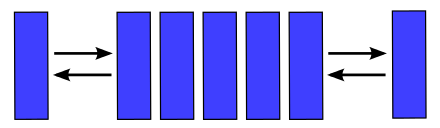

# Double ended queue(Двухсторонняя очередь)

Двусвязная очередь (жарг. дэк, дек от англ. deque — double ended queue; двухсторонняя очередь, очередь с двумя концами) — абстрактный тип данных, в котором элементы можно добавлять и удалять как в начало, так и в конец.

## Операции с деком
- PushBack — добавление в конец дека.
- PushFront — добавление в начало дека.
- PopBack — выборка с конца дека.
- PopFront — выборка с начала дека.
- IsEmpty — проверка наличия элементов.