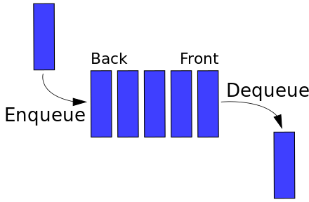

# Очередь(Queue)

Очередь — абстрактный тип данных, представляющий собой упорядоченную коллекцию элементов, в которой добавление новых происходит с одного конца, называемого “хвост очереди”, а удаление существующих - с другого, “головы очереди”.

Элемент, который пробыл в очереди дольше всего, находится в её начале. Такой принцип упорядочения иногда называют **FIFO**(англ. first-in first-out “первым пришёл - первым вышел”).



## Операции с очередью
Базово имеет операции:
- ENQUEUE - добавляет новый элемент в конец очереди
- DEQUEUE - удаляет из очереди первый элемент
- PEEK - возвращает верхний элемент стека, но не удаляет его.  
- EMPTY - проверяет очередь на пустоту
- LEN - возвращает количество элементов в очереди

## Реализация

```go
package queue

import (
	"errors"
	"sync"
)

type Queue struct {
	lock sync.RWMutex
	val  []interface{}
	size int
}

func New() *Queue {
	return &Queue{
		val: make([]interface{}, 0),
	}
}

func (q *Queue) Enqueue(item interface{}) {
	q.lock.Lock()
	defer q.lock.Unlock()

	q.val = append(q.val, item)
	q.size++
}

func (q *Queue) Dequeue() (interface{}, error) {
	q.lock.Lock()
	defer q.lock.Unlock()

	if q.size == 0 {
		return nil, errors.New("Queue  is  empty")
	}

	res := q.val[0]
	q.val = q.val[1:]
	q.size--

	return res, nil
}

func (q *Queue) IsEmpty() bool {
	q.lock.RLock()
	defer q.lock.RUnlock()
	return q.size == 0
}

func (q *Queue) Len() int {
	q.lock.RLock()
	defer q.lock.RUnlock()
	return q.size
}
```

Вместо [слайса](../dynamic_array/README.md) можно использовать  [связный список](../linked_list/README.md). Это даже предпочтительней, т.к. память, выделенная под массив не возвращается, поэтому с долго живущими очередями это может стать проблемой. 