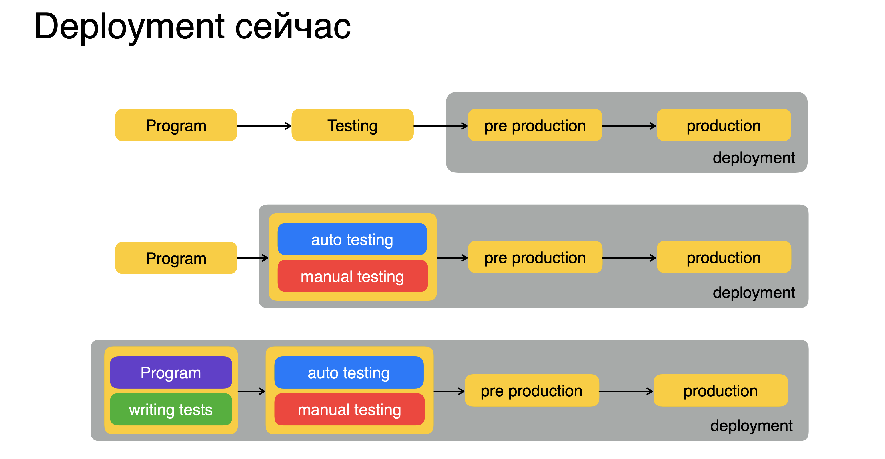

# Инфраструктура

- [Контейнеры](containers/README.md)
- [<- назад](../README.md)

## SLA (Service Level Agreement)

Описывает качество услуг в заданный период (день, месяц или год).

## Типичная структура проекта

## Deployment

### Сборка артефактов

Подготовка кода к деплою. Для разных языков может происходить по разному. В го происходит компиляция и создание бинарного файла под определенную систему.

### Доставка

Полуенный артефакт доставляется на удаленные сервера. Существует масса способов сделать CD и вещей, которые это облегчают (gitlab ci/cd и тд). 

Для настройки этих серверов используются "Системы для управления конфигурациями".

**Системы для управления конфигурациями**
 
Позволяют применять конфигурации к другим системам.
- Когда нужно добиться «примерно» одинаковой
конфигурации на множестве групп хостов
- И при этом группы и роли у хостов разные
- Infrastructure as Code - подход, при котором команда
людей может работать с инфраструктурой в VCS
репозитории, и применять изменения к инфраструктуре

Бывают:
- С агентом (Puppet, Chef, salt)
  - Агент ходит в систему управления конфигурациями и спрашивает что ему установить
- Без агента (Ansible)
  - Система управления конфигурациями сама идет на сервер по SSH и устанавливает

## Запуск

Запуск происходит в контейнерах. Это позволяет унифицировать запуск ваших приложений, написанных на разных языках/версиях и тд.

Как правило, в качестве контейнера используется Docker.

# Литература и видео
- [Инфраструктура - Дмитрий Орлов](https://www.youtube.com/watch?v=uRA5bL-vkQg&list=PLQC2_0cDcSKBHamFYA6ncnc_fYuEQUy0s&index=7)

# Разобрать
- [Managing my personal server in 2020](https://github.com/erebe/personal-server)
- [Воркшоп: Знакомимся с Observability на практике. Елена Граховац](https://www.youtube.com/watch?v=7h7HOge2MAw)