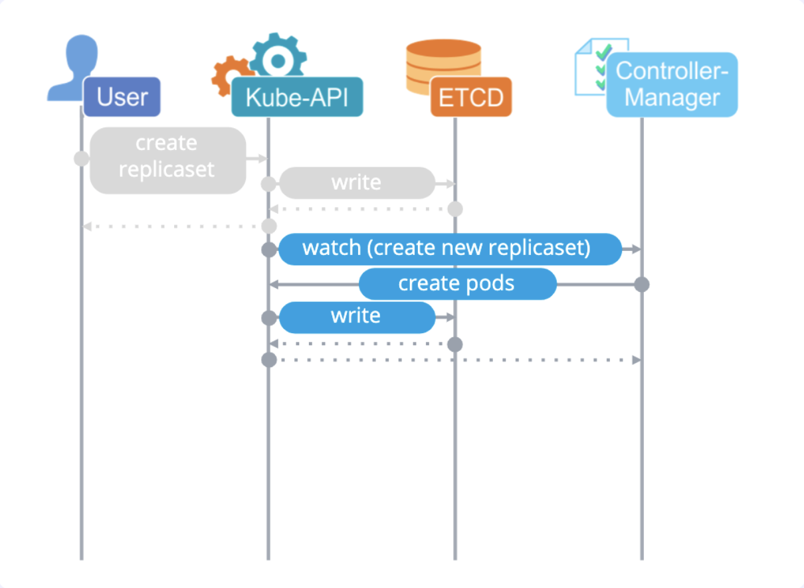

# k8s

Система оркестации контейнерами.

# Aplication abstractions

## POD
Это минимальная абстракция кубера. В поде обычно запущено минимум 2 контейнера: контейнер с вашим приложением и служебный контейнер (нужен для поднятия сети внутри пода). Мы можем подконектиться к поду, прочитать логи, выполнить команды и тд.

Основные команды:
- Получение списка подов: `kubectl get pod` 
- Посмотреть информацию о поде и события по нему: `kubectl describe pod my-pod`
- Удалить под: `kubectl delete pod my-pod`

## Replica set
Позволяет удобно скелить приложение (увеличивать количество подов). Но с помощью него не очень удобно обновлять наше приложение. Служебная абстракция, обычно ею напрямую мы не пользуемся.

Основные команды:
- Получение списка сетов: `kubectl get replicaset`
- Посмотреть информацию о сете и события по нему: `kubectl describe replicaset my-pod`
- Удалить сет: `kubectl delete replicaset my-pod`

## Deployment
Еще более верхнеуровневая абстракция (надо подами и репликасетами). Позволяет удобно управлять приложениями и обновлять их.

Основные команды:
- Получение списка сетов: `kubectl get deployment`
- Посмотреть информацию о сете и события по нему: `kubectl describe deployment my-pod`
- Удалить сет: `kubectl delete deployment my-pod`

## Job

Абстракция, которая позволяет выполнять разовые задачи (прогон миграций, билд кода и тд).

- Создает POD для выполнения задачи
- Перезапускает поды до успешного выполнения задачи или истечения таймаутов

Обязательно стоит указывать настройки `backoffLimit`(количество ретраев, если под упал с ошибкой) и `activeDeadlineSeconds`(ограничение работы джобы по времени).

## Cronjob

- Создает джобы по расписанию.
- Важные параметры:
- - `concurrencyPolicy` - показывает, можно ли запускать следующую джобу, если еще не выполнилась предыдущая (запускаем джобу раз в минуту, пришло время запуска следующей, но предыдущая еще не отработала). Лучше ставить сразу в `Forbid` и не разрешать запускать несколько джоб (чтобы в случае дедлоков не наплодить джоб и не положить кластер).
- - `successfulJobsHistoryLimit` - показывает сколько успешно выполнененных джобов сохранять (остальные очищаются).
- - `failedJobsHistoryLimit` - показывает сколько неуспешно выполнененных джобов сохранять (остальные очищаются).
- - `startingDeadlineSeconds` - сколько времени мы даем на запуск джобы. Лучше, когда это время меньше чем период запуска джоб (джобы запускаем каждую минуты, значит параметр должен быть меньше 60 секунд). Это необходимо делать из-за особенности работы кубера. Так же необходимо не делать меньше 10 секунд, т.к. кронджоб контроллер проверяет ревизию раз в 10 секунд, поэтому это время у него может уйти на создание джобы.

Кронджобы имеют очень много подводных камней, поэтому их стоит использовать на свой страх и риск. В документации написано:

- Кронджобы создают джобы примерно один раз за запуск. Другими словами, за раз может быть создано несколько одинаковых джоб или ни одной. Поэтому джобы должны быть иденпотентны. 

# Network abstractions

## Probes
Позволяет следить за тем, живо ли наше приложение.

### Liveness Probe
- контроль за состоянием приложения во время его жизни
- исполняетсяпостоянно
- в случае провала пробы, приложение рестартится

### Readiness Probe
- проверяет, готово ли приложение ринимать трафик
- в случае неудачноговыполнения риложениеубирается из балансировки
- исполняется постоянно

### Startup Probe
- проверяет, запустилось ли приложение
- исполняется при старте

## Service
Абстракция для публикации приложения. Чаще используется для настройки внутри кластерного взаимодействия.
- Это статический IP адрес, который выдается ему при создании объекта. 
- Это DNS имя которое создается в kube-dns на этот IP (myservice.mynamespase.svc.cluster.local)
- Это правила iptables для роутинга

Виды сервисов:
- Cluster IP
- NodePort
- LoadBalancer
- ExternalName
- ExternalIPs

## Ingres

Используется для опубликации своих приложений наружу. Чаще всего представляет собой Nginx который маршрутизирует входящий трафик на наши поды.

# Устройство кластера

## Etcd
База данных кластера кубернетиса.
- Это KV хранилище
- Хранит всю информацию о кластере
- Поддерживает протокол кворума RAFT
  
## API server
- Центральный компонент кубера
- Единственный кто общается с Etcd
- Работает по REST API
- Kubectl как раз шлет запросы в него
- Authentication and authorization. Вся аутентификация и авторизация происходит здесь.
  

## Controller-manager
Это набор набор контроллеров, которые следят за событиями и изменениями в кубере и производят какие то действия (создание подов, перезапуск, вывод в оффлайн и тд).

- Набор контроллеров:
- - Node controller. Следит за состоянием нод. Если нода перестала отвечать, то он помечает (через API server) такую ноду как недоступную и запускает перенос подов с этой ноды на другие ноды кластера.
- - Replicaset controller. Создает в кластере поды
- - Endpoints controller
- - И другие...
- Garbage collector - сборщие мусора. Подчищает ненужный мусор (удаляет старые репликасеты и тд)

## Scheduler
Назначает поды на ноды, учитывая:
- QoS(quality of service) - в зависимости от реквестов и лимитов по ресурсам, планировщик будет искать подходящую ноду
- Affinity / ani-affinity - правила размазывания подов. Например я хотел бы чтобы поды этого деплоймента запускались на определенной группе нод (ноды у которых есть GPU)
- Requested resources
- Priority class

Процес выбора нод состоит из двух вещей:
- фильтрация (когда убираются ноды которые точно не подойдут)
- скоринг (когда по разным критериям нодам добавляются балы и выбираются ноды с самым большим показателем)

Важный момент: шедулер лишь назначает поды на ноды, но не запускает их. Он принимает решение, и записывает его в etcd через Api server.

## Kubelet

- В отличии от предыдущих компонентов, которые запускаются на мастер ноде (отдельно от наших подов), кублет работает на каждой ноде кластера (на мастер нодах и на воркер нодах).
- Обычно едиственный компонент который работает не в докере
- Отдает команды докер демону (docker run / docker stop и тд)
- Создает PODы
- Делает проверки проб (liveness probes / readiness probes / startup probes)
- Отправляет информацию о своей ноде: 
- - жив ли он сам
- - какие контейнеры в каком количестве запущены
- - сколько ресурсов на ноде осталось

 

## Kube-proxy
Занимается реализацией некоторых сетевых абстракций (например Service)
- Смотрит в API Server
- Стоит на всех серверах (как и кублет)
- Управляет сетевыми правилами на нодах (например конфигурит IP Tables)

# Разобрать
- [Курс слерма по куберу](https://www.youtube.com/watch?v=Mw_rEH2pElw&list=PL8D2P0ruohOBSA_CDqJLflJ8FLJNe26K-)