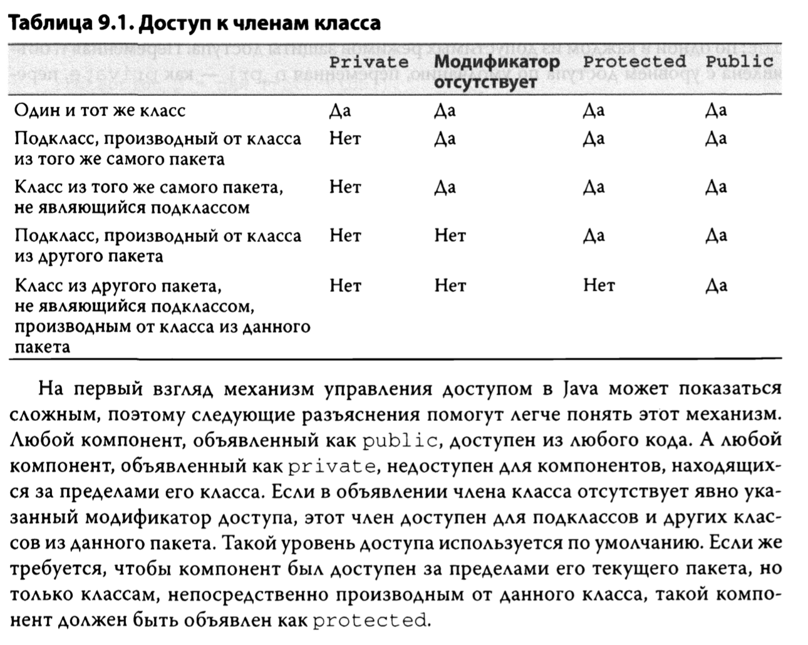
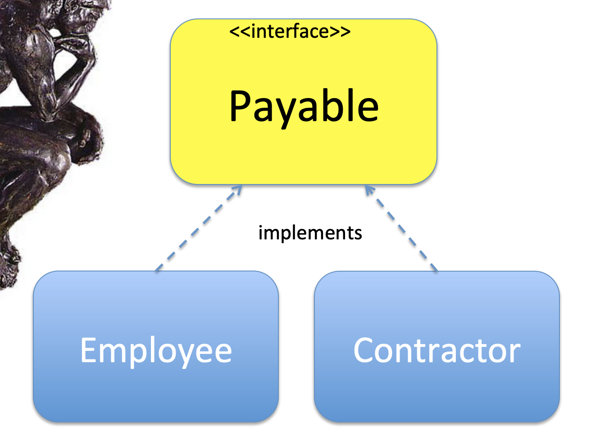
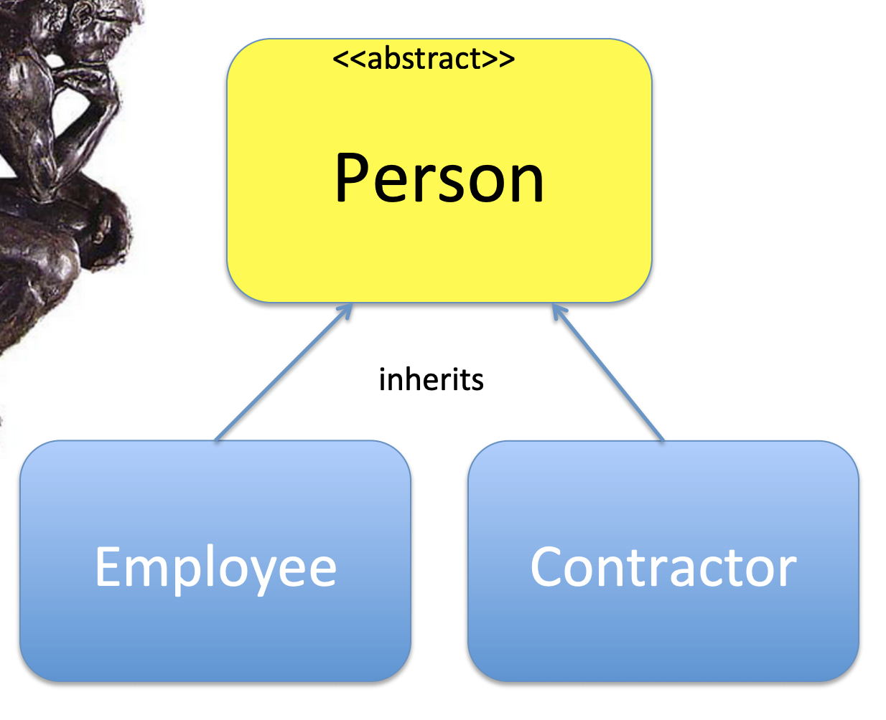
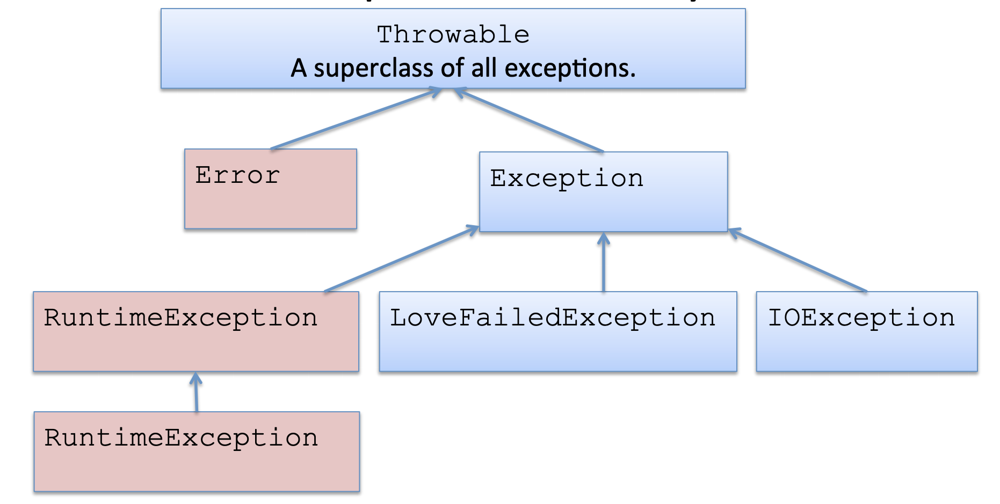

# JAVA

## Arays

```java
    String[] friends = new String[20]
```

Массивы в джаве заданной длины. Непроинициализированные члены этого массива будут `null`.

Так же в джаве есть матрицы (multi-dimensional arrays)

```java
    String[][] friends = new String[20][2]

    friends[0][0] = "Masha";
    friends[0][1] = "+7 (999) 999 99 99"
```

## Wrapper Classes

В джаве есть примитивы (`int`, `boolean`), а есть обертки над примитивами. Они бывают полезны, т.к.:

- Содержат полезные методы для данного примитива
- В некоторых случаях ты можешь использовать только объекты (не примитивы)

## Циклы

**For цикл:**
```java
    int totalElemens = friends.length;
    int i;

    for (i=0; i<totalElements; i++) {
        System.out.println("I love " + friends[i]);
    }
```

**For-Each цикл:**
```java
for (String girl: friends) {
    System.out.println("I love " + girl);
}
```

**While цикл:**

Обычный:

```java
    int totalElemens = friends.length;
    int i;

    while (i<totalElements) {
        // Do something
        i++;
    }
```

С постусловием:
```java
    int totalElemens = friends.length;
    int i;

    do {
        // Do something
        i++;
    }  while (i<totalElements);
```

## Packages (пакеты):

Джава проект может содержать сотни классов, поэтому для их организации используют *пакеты*. Пакеты организуются по приципу `reverse dns notation`. Допустим вы разрабатываете программу для департамента аккаутинга в корпорации Acme:

```java
    package com.acme.accounting;
    class Tax{
        // the class code goes here
    }
```

Соответственно код класса будет располагаться в директории:
```
com	
	acme	
		accouning
```

Теперь, для того, чтобы использовать этот класс его необходимо заимпортить:

так:
```java
    import com.acme.accounting.Tax;
    class TestTax{… Tax t = new Tax(); ….}
```

или так:
```java
    com.acme.accountimg.Tax t = new com.acme.accounting.Tax();
```

## Data	Access Levels

Джава классы, методы и переменные могут иметь `public`, `private`,  `protected` and `package` уровень доступа. Например:

```java
    public class Tax {
        private double grossIncome;
        protected String state;
        private int dependents;

        public double calcTax() {
        // do something here
        }
    }
```

- public - любой другой класс имеет доступ к переменной/методу  
- protected	- только подклассы(сабклассы) имеют доступ к переменной/методу	
- private - только другие члены этого класса имеют доступ к переменной/методу
- package - только классы распологающиеся в этом же пакете имеют доступ	к переменной/методу

Вот примерная схема:



Если не указал уровень доступа, то по умолчанию выставляется `package`

## The keyword final

В джаве есть зарезервирвоанное слово `final`, которое добавляет разные ограничения, в зависимости от того, в где оно используется:

- Если в объявлении метода, то этот метод не может быть переопределен (в потомках):

```java
    static final double convertToCelsius(double far){
        return ((far - 32) * 5 / 9);
    }
```

- Если в объявлении класса, то от этого класса нельзя наследоваться (он не может иметь сабклассы).

```java
    final class Tax {…};
```

- Если в объявлении переменной, то значение такой переменной может быть присвоено только 1 раз (почти как константа).

```java
    static final int BOILING_TEMP = 212; // in Fahrenheit
```

- При обработке исключений все параметры catch неявно являются окончательными, но вы можете явно указать это:

```java
    try{
    // do something
    } catch (final IOException e){
    // handle error here
    }
```

## OOP

В джаве не поддерживается множественное наследование.

## Interface

Интерфейсы это описание поведения. Интерфейсы содержат только описание методов и final variables.

```java
    public interface Payable {
        boolean increasePay(int percent);
    }
```

Классы, в свою очередь могу реализовывать интерфейсы. Это указывается при создании класса:

```java
    class Employee implements  Payable, Promotionable {};

    class Contractor implements Payable {};
```

## Casting

Все классы наследуются от класса Object. Когда мы объявляем переменную, мы можем объявить ее как того же типа, так и типа предка (супер класса). Это называется `upcasting`

```java
    NJTax myTax1 = new NJTax();
    Tax myTax2 = new NJTax(); // upcasting
    Object myTax3 = new NJTax(); // upcasting
```

Если `Emploee` и `Contractor` наследники класса `Person`, то мы можем создать массив `Person`, но добавлять туда `Emploee` и `Contractor`.
```java
    Person workers[] = new Person [100];

    workers[0] = new Employee(“Yakov”, “Fain”);
    workers[1] = new Employee(“Mary”, “Lou”);
    workers[2] = new Contractor(“Bill”, “Shaw”); 
```

В примере выше, у нас получился массив, наполненный объектами разных классов. Для того, чтобы понять, с объектом какого класса мы сейчас работаем, мы можем применить оператор `instanceof`.

```java
    Person workers[] = new Person [20];
    // Populate the array workers here….
    for (int i=0; i<20; i++){
        Employee currentEmployee;
        Contractor currentContractor;
        
        if (workers[i] instanceof Employee){                // type check
            currentEmployee = (Employee) workers[i];        // downcasting
            // do some employee-specific processing here
        } else if (workers[i] instanceof Contractor){
            currentContractor = (Contractor) workers[i];    // downcasting
            // do some contractor-specific processing here
        }
    }
```

Как мы видим в примере, помимо `upcasting`, мы можем использоваться `downcasting`.

Оператор `instanceof` дорогой, поэтому его лучше избегать.

## Abstract classes

Абстрактные класс напоминают рубишные модули: это класс, который описывает поведение, в котором могут быть как реализованные методы, так и методы, которые прийдется реализовать потомкам (абстрактные методы). Абстрактный класс используется: 
- для вынесения общих вещей для классов, которые от него унаследуются (общего кода)
- для единообразности названия методов (абстрактных), которые будут реализованны в каждом сабклассе.

Абстрактный класс не может создавать объекты.

```java
    abstract public class Person {

        private String name;
        int INCREASE_CAP = 20; // cap on pay increase

        public Person(String name){
            this.name=name;
        }

        public String getName(){
            return "Person's name is " + name;
        }

        public void changeAddress(String address){
            System.out.println("New address is" + address);
        }

        private void giveDayOff(){
            System.out.println("Giving a day off to " + name);
        }
 
        public void promote(int percent){
            System.out.println(" Promoting a worker...");
            giveDayOff();
        
            //call the abstract method increasePay(percent) here
            increasePay(percent);
        }

        // an abstract method to be implemented in subclasses
        public abstract boolean increasePay(int percent);
    }

    public class Employee extends Person{

    public Employee(String name){
        super(name);
    }

    public boolean increasePay(int percent) {
        System.out.println("Increasing salary by " +
        percent + "%. "+ getName());

        return true;
    }
}
```

Метод `increasePay()` должен быть реализован в сабклассах, иначе из них нельзя будет создавать объекты.

## Interfaces vs Abstract classes

Часто одну и ту же задачу можно решить и с помощью абстрактных классов и с помощью интерфейсов.





Часто бывает так, что мы вынужденны унаследоваться от чего-то другого (например так устроен фреймворк), поэтому общее поведение нам приходится выносить в интрейфейс (т.к. в джаве нет множественного наследования).

## Error handling

Джава компилятор, зачастую заставляет обрабатывать ошибки в программах. Обработка происходит двумя способами:
- try-catch блок
- пробросить ошибку выше

**try-catch**

```java
    try{
        fileCustomer.read(); // the file may be corrupted or missing
    }
    catch (IOException e){
        System.out.println("There seems to be a problem with the file customers.");
    }
```



Ошибки, являющиеся сабклассами от класса `Error` и `RuntimeExeption` являются фатальными ошибками и не обязательны для обработки (обычно эти ошибки сообщают о проблемах, не совместимых с работой приложения. Например закончилась память и тд).

```java
    public void getCustomers(){
        try{
            fileCustomers.read(); // may throw an error
        } catch(FileNotFoundException | EOFException | IOException e){
            System.out.println("Problem reading file " +e.getMessage());
        } catch (Exception e1){
            System.out.println("Something else went wrong");
        }
    }
```

**Пробрасывание ошибки выше (throws keyword)**

Если вы не планируете обработку ошибки(исключения) в своем методе, необходимо добавить слово `throws` в описание метода.

```java
    class CustomerList{	
		void getAllCustomers() throws IOException{	
			// Some other code goes here		
			// Don’t use try/catch if you are not handling exceptions in this method
			file.read();		
		}	
		
		public static void main(String[] args){	
			System.out.println("Customer List");			
			
            // Some other code goes here		
			
            try{	
				// Since getAllCustomers() declares an exception,
				// either handle it	over here, or re-throw it		
				getAllCustomers();			
			}	
			catch(IOException e){	
				// Exception is considered handled	
				System.out.println("Customer List is not available");	
			}
        }
    }
```

**finally keyword**

`Finally` похоже на `defer` в го. Код, который должен быть выполнен в любом случае.

```java
    try{
        file.read();
        //file.close(); don’t close files inside try
    }
    catch(Exception e){
        e.printStackTrace();
    } 
    finally{
        if (file != null){
            try{
                file.close();
            }catch(IOException e1){
                e1.printStackTrace();
        }
    }
```
Используется для закрытия файлов, коннектов и тд.

Также есть возможность использовать `try-catch` с автоматическим закрытием ресурсов. Для этого необходимо, чтобы ресурс имплементировал `java.lang.AutoCloseable` или `java.io.Closeable` интерфейс.

```java
    InputStream myFileInputStream = null;

    try (myFileInputStream=new FileInputStream(“customers.txt”);) {
        // the code that reads data from customers.txt goes here
    } catch (Exception e){
        e.printStackTrace();
    }
```

## Generics

В джаве есть дженерики. Например `ArrayList`. Он позволяет добавлять в коллекцию объекты разных типов. Также, при инициализации `ArrayList` возможно указать тип элементов, которые в него могут быть добавлены. Это позволяет осуществлять проверку на этапе компиляции, а также избежать кастинга при переборе элементов `ArrayList`.

```java
    ArrayList<Customer> customers = new ArrayList<>();

    Customer cust1 = new Customer("David","Lee");
    customers.add(cust1);

    Customer cust2 = new Customer("Ringo","Starr");
    customers.add(cust2);

    Order ord1 = new Order();
    customers.add(ord1); // Compiler error because of <Customer>
```

Также джава позволяет создавать свои дженерик классы.

```java
    public class Box<T> {
        private T t;

        public void add(T t) {
            this.t = t;
        }

        public T get() {
            return t;
        }
    }

    public class Main {

        public static void main(String[] args) {
            Box<Integer> b = new Box<>();

            b.add(1);
            b.add(2);

            System.out.println(b.get());
        }
    }
```

**Наиболее часто используемые названия параметров**

- E - Element	
- K - Key	
- N - Number	
- T - Type	
- V - Value

**Примеры типов**

- < T > - тип Т
- < ? > - неизвестный тип
- < ? extends Customer > - любой тип, который наследуется от класса Customer (любой его сабкласс)
- < ? super Customer > - любой тип который является является суперклассом для класса Customer


# Разобрать

- [Chronicle Map — key value хранилище для трейдинга на Java](https://www.youtube.com/watch?v=iTJpGa3W0xc)
