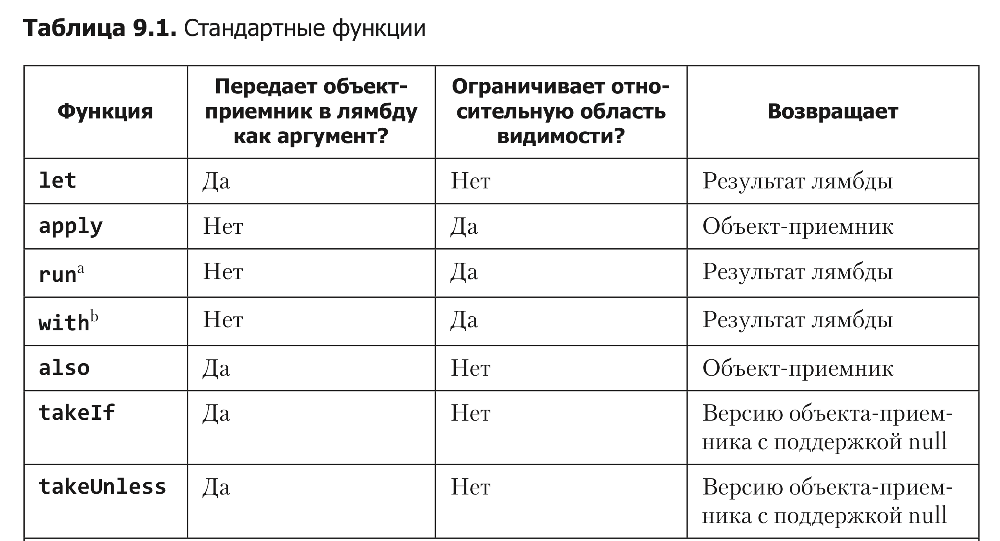
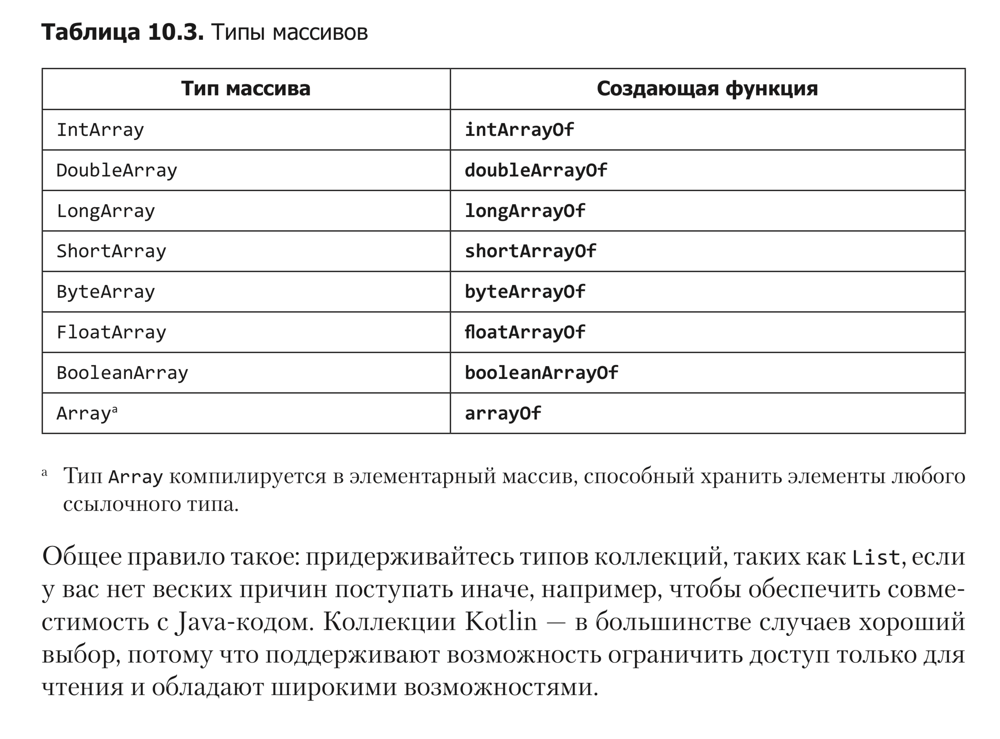

# Kotlin

## Стандартные функции



## Коллекции

### Совместимость с примитивными Java массивами



## Классы

### Вспомогательные объекты

Если вы хотите связать инициализацию объекта с экземпляром класса, это можно организовать, определив вспомогательный объект. Вспомогательный объект объявляется внутри класса с помощью модификатора companion. У класса не может быть больше одного вспомогательного объекта.

Инициализация вспомогательного объекта выполняется в двух случаях: при инициализации вмещающего класса, что делает его хорошим местом для хране- ния данных в единственном экземпляре, имеющих контекстную связь с объяв- лением класса, и при прямом обращении к одному из его свойств или функций.

```kotlin
class PremadeWorldMap {
    ...
    companion object {
        private const val MAPS_FILEPATH = "nyethack.maps"
        fun load() = File(MAPS_FILEPATH).readBytes()
    }
}
```

У `PremadeWorldMap` есть вспомогательный объект с единственной функцией `load`. Если потребуется вызвать `load` еще где-нибудь в коде, вы сможете сделать это без создания экземпляра `PremadeWorldMap`, как показано ниже:

```kotlin
PremadeWorldMap.load()
```

Содержимое файла будет загружено вспомогательным объектом только один раз, во время инициализации экземпляра PremadeWorldMap или при первом вы- зове функции load. И неважно, сколько экземпляров PremadeWorldMap будет создано, потому что вспомогательный объект всегда существует в единственном экземпляре.

### Абстратные классы и Интерфейсы

Хорошее правило: если нужна категория поведения или свойств, общая для объектов, но неудобная для наследования, используйте интерфейс.

# Разобрать
https://kotlinlang.org/docs/reference/coroutines/basics.html
https://proandroiddev.com/kotlin-coroutines-channels-csp-android-db441400965f