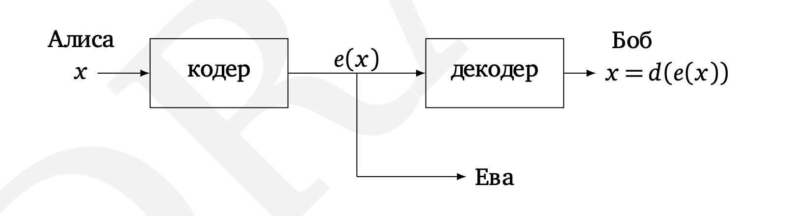

# Криптография

Три любимых героя криптографов –– Алиса (A) и Боб (B), которые хотят
переговорить без свидетелей, и любопытная Ева (E), которая их подслушивает. (По-английски «подслушивающий» будет «eavesdropper», что объясняет выбор имени.) Пусть, скажем, Алиса хочет послать Бобу секретное сообщение –– строку битов x. Она шифрует x с помощью функции e(·) и посылает Бобу зашифрованное сообщение e(x). Боб использует функцию d(·), чтобы восстановить (дешифровать) исходное сообщение: d(e(x)) = x.



Алиса и Боб опасаются, как бы Ева не подслушала e(x). Они надеются,
что Ева, не знающая алгоритма расшифровки d, не сможет извлечь никакой
информации об x из e(x).

Довольно долго криптография была основана на использовании секретного («закрытого») ключа (private key). Таким ключом может быть, скажем,
заранее составленная и известная только им двоим таблица для кодирования и декодирования (codebook). Не зная этой таблицы, Ева не сможет ничего понять (разве что одни и те же коды будут использоваться многократно, и это даст частичную информацию о сообщении).

Но как быть, если Алиса и Боб никогда не встречались и всю их переписку Ева может читать с самого начала? Смогут ли они передать друг другу что-то в секрете от неё? На первый взгляд кажется, что это невозможно: если из их переписки можно извлечь способ расшифровки, то он доступен Еве, если же нет –– то как они сами смогут что-то расшифровать?

Оказывается, что это всё-таки возможно, если воспользоваться разницей
между сложностью задачи проверки простоты (и отыскания простых чисел)
и задачи разложения на множители. На этом основана система шифрования
RSA с открытым ключом (Rivest––Shamir––Adleman public-key cryptosystem). При её использовании Боб сообщает Алисе некоторую информацию –– «открытый ключ». С её использованием Алиса может зашифровать своё сообщение. Но расшифровать его сможет только Боб, поскольку одного открытого ключа для этого мало. (Эта схема используется при передаче секретных данных, типа номеров кредитных карт, по интернету.)

При этом Алисе и Бобу не нужно выполнять особо сложных вычислений
для шифрования и дешифрования, с ними справится и мобильный телефон.
Но расшифровка, хотя теоретически и возможна, требует умения раскладывать числа на множители, и даже суперкомпьютеры в этом не помогут. Именно за счёт этого разрыва система RSA произвела революцию в криптографии.

## Схемы шифрования с закрытым ключом

Есть несколько таких схем:
- Одноразовый ключ 
- AES

**Одноразовый ключ**

В протоколе шифрования с **одноразовым ключом** (one-time pad) Алиса и
Боб встречаются заранее и выбирают ключ –– битовую строку `r` той же длины, что и будущее сообщение. Шифрование сообщения `x` состоит в побитовом сложении `x` c ключом `r`. Каждый бит строки `e(x)` равен сумме по
модулю два соответствующих битов `x` и `r`; эта операция называется `XOR`
(eXclusive OR, «исключающее ИЛИ»): `er(x) = x ⊕ r`. Например, если выбран
ключ `r = 01110010`, то сообщение `x = 11110000` кодируется как

```
er(11110000) = 11110000 ⊕ 01110010 = 10000010.
```

Легко сообразить, что функция `er` обратна к самой себе (в том смысле, что,
применив её второй раз, мы вернёмся к исходному сообщению):

```
er(er(x)) = (x ⊕ r) ⊕ r = x ⊕ (r ⊕ r) = x ⊕ ¯¯0 = x;
```
здесь ¯¯0 –– строка из одних нулей. Так что дешифрование просто повторяет
шифрование.

Конечно, эту схему можно использовать только однажды (отсюда и название). Если послать таким способом два сообщения `x` и `z`, то Ева сможет восстановить `x ⊕ z`, поскольку 

```
(x ⊕ r)⊕(z ⊕ r)= (x ⊕ z)⊕(r ⊕ r)= x ⊕ z ⊕¯¯0= x ⊕ z.
```

Эта информация может быть существенной: скажем, по `x ⊕ z` видно, начинаются ли `x` и `z` на одно и то же. А если одно из сообщений содержит длинный
кусок из подряд идущих нулей (что вполне возможно, если это картинка), то
в `x ⊕ z` на соответствующем месте будет просто кусок другого сообщения. Поэтому «бывшие в употреблении» биты нельзя использовать повторно, и запаса общих случайных битов должно хватить на все будущие сообщения.

**AES**

Похожий (и в то же время широко использующийся) способ шифрования описан в стандарте AES (advanced encryption standard). Как и прежде, Алиса и Боб заранее выбирают случайную строку битов `r`, но фиксированной длины –– 128 битов (есть варианты с длинами 192 и 256). Зная `r`, можно
вычислять взаимно однозначную функцию `er` на строках длины 128. Ключевое отличие состоит в том, что эта функция используется много раз: длинное
сообщение разбивают на куски длиной 128 битов и применяют `er` к каждому
из них.

Надёжность стандарта AES не доказана. В то же время никто не знает
(или, по крайней мере, не публикует!) способа расшифровки сообщений, не
требующего перебора нереально большого числа вариантов

## RSA

# Разобрать

- https://habr.com/ru/company/yandex/blog/324866/